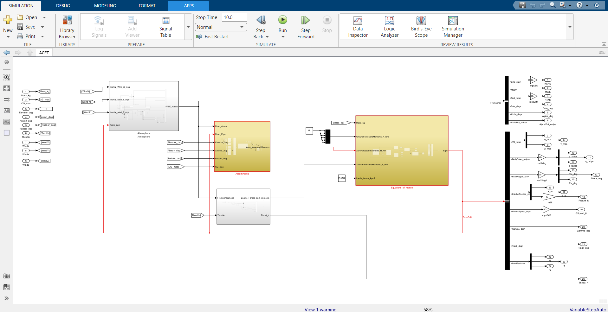

# 6_dof_Simulink_model
This repository contains simulink files for atmospheric, equations of motions, propuslion and aerodynamic blocks for a fixed wing aircraft model(Aircraft flight control system repo model). the complete model emulates the 6 degrees of freedom motion of a fixed-wing aircraft , which can be further used for various research and analysis.

### Simulink Model block diagram

